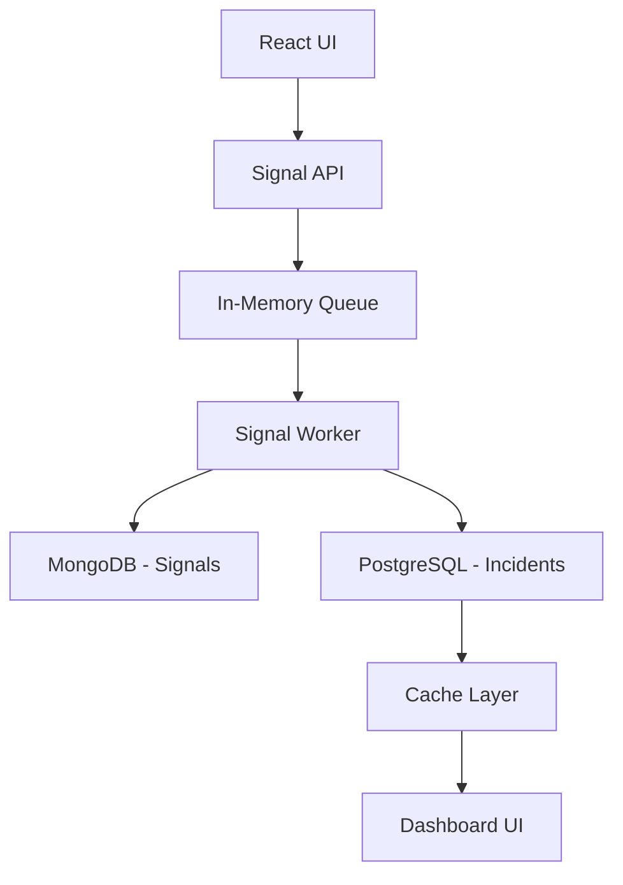

#  Incident Management System (IMS)


---

##  Demo

[Watch Here](https://drive.google.com/file/d/106J-sIGM9j3WxB25iyxjg3frYYfQFMl4/view)

---
##  Non-Functional Enhancements
- Logging implemented using SLF4J
- Asynchronous processing using @Async
- CORS configured
- Exception handling added
- Input validation added
- Docker-based setup

---

##  Overview

A scalable Incident Management System that ingests high-volume signals, processes them asynchronously, and manages incidents with RCA and MTTR tracking.

---

##  Features

* Async signal processing using queue-worker model
* MongoDB for raw signals
* PostgreSQL for structured incidents
* Debouncing to avoid duplicate incidents
* RCA validation before closure
* MTTR auto-calculation
* React dashboard with live updates

---

##  Architecture Diagram



---

## Tech Stack

**Backend**

* Spring Boot
* PostgreSQL
* MongoDB

**Frontend**

* React.js

**DevOps**

* Docker Compose

---

## ️ Setup Instructions

```bash
## 🚀 Run Project

### 1. Start Docker
docker-compose up -d

### 2. Start Backend
cd backend
mvn spring-boot:run

### 3. Start Frontend
cd frontend/ims-ui
npm install
npm start
```

---

##  API

### POST /api/signal

Ingest signal

### GET /api/incidents

Fetch all incidents

### POST /api/rca/{id}

Submit RCA

---

## Backpressure Handling

* In-memory queue buffers incoming signals
* Worker processes signals asynchronously
* Prevents system crash under high load

---

##  Sample Data

Located in `/sample-data/signals.json`

---

##  Design Highlights

* Async architecture for scalability
* Separation of NoSQL and SQL storage
* Fault-tolerant ingestion
* Real-time dashboard

---

##  Future Improvements

* WebSocket live updates
* Kafka integration
* Alerting system

---

##  Author

Bhagyavan 
